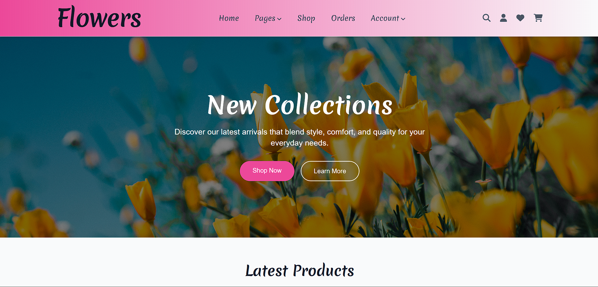
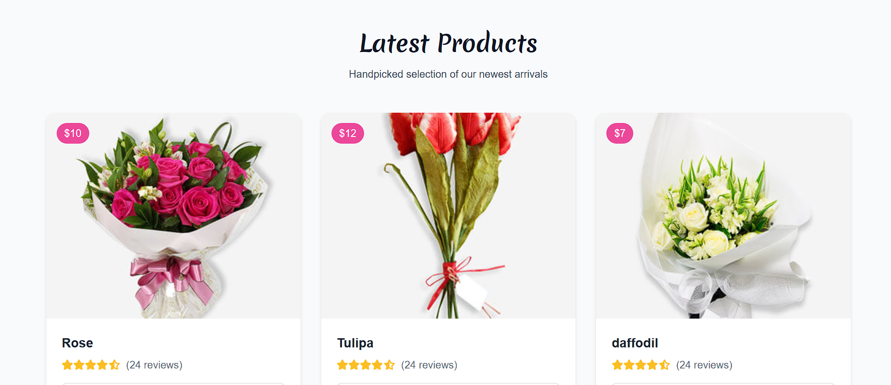
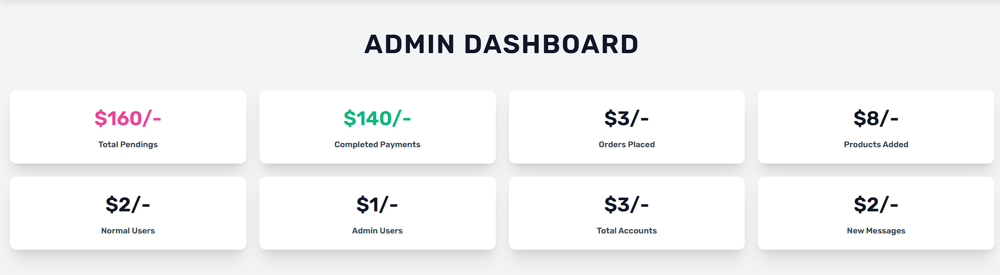

# flowers_shop_PHP
🌸 Flower Shop Website

A fully responsive and dynamic Flower Shop web application built using **HTML, Tailwind CSS, JavaScript**, and **PHP with MySQL**.  
This project allows users to browse flowers, manage their cart, and place orders, while also providing admin functionality to manage products.

📸 Demo




 🚀 Features

- 🌼 Beautiful UI styled with **Tailwind CSS**
- 🛒 Add to cart and place orders
- 🔐 User registration and login system
- 📩 Contact form (messages stored in MySQL)
- 📊 Admin panel to manage flowers and view orders
- ⚡ Form validation using JavaScript
- 📱 Fully responsive on all devices
- 💻 PHP and MySQL for backend functionality
- 📈 Dynamic product display with filtering and sorting
- 📊 Order management and tracking
- 📈 Admin dashboard with analytics
- 📊 User management and login system 
- 📈 Contact form and message management

🛠 Tech Stack

### 💻 Frontend:
- HTML5
- Tailwind CSS (via CDN)
- JavaScript (Vanilla)

### 🔧 Backend:
- PHP (Procedural)
- MySQL (phpMyAdmin for DB management)

## 🗂️ Folder Structure

---

## ⚙️ Setup Instructions

### 1. Clone the Repository
```bash
git clone https://github.com/Rahat532/flowers_shop_PHP.git
cd flower-shop

css/ – Likely contains custom stylesheets (in addition to Tailwind).

flowers/ – Possibly holds flower item data or images.

images/ – Static image assets used across the site.

js/ – JavaScript files for UI interactions.

uploaded_img/ – Directory where uploaded product images (from admin panel) are stored.

📄 Key PHP Files:
about.php – About page for the flower shop.

cart.php, checkout.php – Handles cart and purchase logic.

admin_* files – Admin panel functionality for managing:

Contacts/messages: admin_contacts.php

Orders: admin_orders.php

Page layout/header: admin_header.php

Pages/content: admin_page.php

Products: admin_products.php, admin_update_product.php

Users: admin_users.php

🧠 Future Enhancements
Integrate payment gateway (Stripe, PayPal)

Product category filters & sorting

Admin login with more controls

Order status updates

Dark mode support 🌙

🙌 Contributing
Contributions, issues, and feature requests are welcome!
Feel free to fork the repo and submit a pull request.

👨‍💻 Author
Abdullah Al Rahat
💬 Let’s connect: www.linkedin.com/in/abdullah-al-rahat-5ab878316


